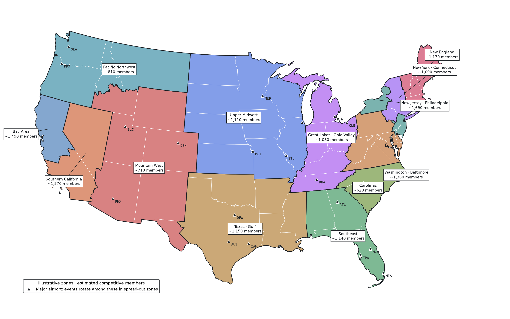

Hi Phil,

I thought about it some more and did some research on how othere organizations handle this sort of situation. Then I did a lot of math.

You had agreed that the current distribution of Region 4 events is not one anyone would design on purpose. You also put scored geography, per-organizer caps and published scores on the table.

With your raising the possibility of further subdividing regions, I would like to make this proposal on how it should be done. I call the new designations zones just to avoid confusion.

**The main axiom: Ensure a competitive field but balance that with making sure events are accessible to the largest number of fencers.**

The current regions and bid process underserve some fencer-dense areas and *impose significant expenses on families and hurt the sport*. This is partially because the system biases towards incumbency and also because it biases against areas with higher cost of living - which then doubly punishes those families by making them travel and pay more.

Of course no set of rules will satisfy everyone, but the rules should be defensible and impartial. In practice what this means is:

1. **Draw zones where fencers live.** A zone is the area within about a two-hour drive of a city with enough fencers to fill real events. Areas with fewer fencers are grouped around a major airport. A published formula (see Appendix B) draws the map from member ZIP codes and redraws it every four years. The 2026-28 Bid Document already calls geography "a determining factor" (p. 9), and the Handbook already commits to redrawing boundaries as membership shifts (p. 80).
2. **Every zone gets its fair share of tournaments.** Each receives a reserved number of regional weekends, in proportion to its competitive members, with a minimum for each zone. Different zones might host on the same weekend subject to referee and other official availability.
3. **Build each zone's schedule from the bottom up. **The available competitive field determines which events zones get reserved starting at the lowest level moving upwards. Any rated event needs 15 fencers; below that, the event is not held in that zone. To get reserved top-level events, a zone needs an A2-strength field. That's what makes a zone full-circuit, whereas zones that cannot bring a competitive field hold lower-level events but still have to travel for the upper levels.
4. **Host criteria set minimum standards, then bids are scored by how accessible the tournament is.** Venue, staffing and referee standards become pass/fail. Proposed fees, surrounding costs, distance from major airports all play a role, but now are competing like-vs-like in the same zone. So the more efficient, accessible host has the advantage.
5. **Quality is maintained through oversight rather than discouraging new bidders.** Poor participant feedback brings oversight at the organizer's next event, and ineligibility if it repeats. Hosting history earns no points, so incumbents do not start ahead. This gives new organizers a path to earn regional events.
6. **This is just host location, not entry restriction.** Anyone may enter any event. Zones decide where events are held, not who may fence in them.
7. **Publish the inputs and the results.** USA Fencing publishes the member counts behind the map, the zone map, each zone's allocation and every bid score.

**What would this look like for USA Fencing.** The map below applies the rules to public data and yields 13 zones. For Region 4's 19 regional weekends this season, the Bay Area would get 7, Southern California 8 and the Mountain West 4. Today the split is 2, 10 and 7, although the Bay Area and Southern California have nearly identical competitive membership (1,451 and 1,523 as of September 2026).

**What I am asking for.**

1. A Tournament Committee review of this proposal, with a stakeholder task force that includes parents, reporting before the 2028-30 bid rubric is set.
2. A run of the method on USA Fencing's own internal member data. Appendix B gives every rule and formula; the map here is only an illustration using public data from AskFRED and USA Fencing's website.
3. Publication of the resulting zone map, the allocations and the bid scores.

Appendix A sets out the reasoning, the objections and the tradeoffs. Appendix B gives the methodology and the exact rules.

Sincerely,

Tarun Nagpal, MD, JD

Parent of a competitive foil fencer

## What the result looks like

Applied to public data, the rules draw 13 zones, and every competitive member is in one. Each zone is large enough to fill its core events locally. Larger zones get more weekends and can also hold more of the younger age groups locally.



*Illustrative only.* Member counts are estimates from AskFRED's rated fencers by division, scaled to match USA Fencing's September 2026 counts for Northern and Southern California. Counties are shaded by the nearest division center. Alaska and Hawaii are not shown and would each be a zone of their own.

| Zone | Est. competitive members | Full circuit | Events held locally (of 42) | Weekends (of 100) | Major airports |
| --- | --- | --- | --- | --- | --- |
| New York · Connecticut | 1,690 | Yes | 26 | 11 |  |
| New Jersey · Philadelphia | 1,690 | Yes | 26 | 11 |  |
| Southern California | 1,570 | Yes | 26 | 10 | LAS |
| Bay Area | 1,490 | Yes | 26 | 10 |  |
| Washington · Baltimore | 1,360 | Yes | 25 | 9 | IAD, PIT |
| New England | 1,170 | No | 23 | 7 | BOS |
| Texas · Gulf | 1,150 | No | 23 | 7 | DFW, IAH, AUS |
| Southeast | 1,140 | No | 23 | 7 | ATL, MCO, MIA, TPA |
| Upper Midwest | 1,110 | No | 23 | 7 | ORD, MSP, MCI, STL |
| Great Lakes · Ohio Valley | 1,080 | No | 20 | 7 | DTW, CLE, BNA |
| Pacific Northwest | 810 | No | 16 | 5 | SEA, PDX |
| Mountain West | 710 | No | 13 | 5 | DEN, PHX, SLC |
| Carolinas | 620 | No | 10 | 4 | CLT |

Weekends are an apportionment of 100 regional weekends a season (USA Fencing listed 100 regional tournaments in 2025-26), with at least 2 per zone. A zone's categories are its 6 weapon events across 7 age groups (Y10, Y12, Y14, Cadet, Junior, Senior, Veteran). Y10, Y12 and Veteran events fall below the 15-fencer floor in most zones, so they are held only where they can fill it. Full circuit means the zone can also host top-level events (SYCs and Division I/IA opens): its Junior and Senior fields reach A2 strength in all six weapons.

**Region 4 under the rule, same 19 weekends as 2026-27:**

| Area | Est. competitive members | Weekends under the rule | Weekends in 2026-27 |
| --- | --- | --- | --- |
| Bay Area | 1,490 | 7 | 2 |
| Southern California (with Las Vegas) | 1,570 | 8 | 10 |
| Mountain West (CO, UT, AZ, NM) | 710 | 4 | 7 |

## Appendix A: Reasoning, objections and tradeoffs

The case in one line: where events go today is decided by bid paperwork and by who bid before, not by where fencers live. Zones fix that with a rule anyone can check.

### What is wrong today

- **Distribution.** In 2026-27, Northern California hosts 2 regional tournaments, down from 7 in 2024-25. Southern California hosts 10, with nearly the same competitive membership (1,451 vs 1,523). Nevada, with 146 members, hosts 3. One Southern California organizer holds 3 slots.
- **Geography is not scored.** The 2026-28 Bid Document calls geography "a determining factor" (p. 9), but in practice it is only a tie-breaker.
- **The scoring form compounds incumbency.** Of about 260 points, 35 depend on track record: years of experience (10), two feedback questions (20) and the committee's history item (5). An experienced organizer with good feedback starts about 24 points ahead of a new one. Most other items check the bid paperwork, which repeat bidders learn.
- **The scoring form penalizes high-cost areas.** Hotel price (full marks at $150 a night or less), parking cost and fee-exemption requests are fixed-dollar scales. A Bay Area bid loses roughly 8 to 15 points before quality is considered, in contests where the CEO says margins were small. The families then pay more to travel to cheaper venues.
- **Two-season awards lock imbalance in.** The 2026-28 cycle awarded both seasons at once, so an uneven pool persists for two years.
- **The cost lands on families.** A regional trip by air costs at least $1,500 for one parent and one fencer. Ten of Region 4's nineteen 2026-27 events run three or more days and include a Friday, which means missed school.

### Why zones

- **Measure opportunity, not attendance.** A good schedule maximizes the number of eligible fencers within reach of each event. A neutral midpoint that everyone flies to is the worst outcome since everyone incurs costs.
- **Fields are local.** A dense area already contains a full field. When its events move away, those fencers pay to meet the same competition somewhere else.
- **Mechanical rules resist lobbying.** Zones drawn by formula from member ZIP codes cannot be negotiated weekend by weekend. They are redrawn every quadrennial, as Handbook p. 80 already requires of regions.
- **Precedent exists.** [USA Volleyball](https://usavolleyball.org/wp-content/uploads/2025/11/2026-Girls-Championship-Manual-Jan_27_2026-1.pdf) gives every region at least one national bid and adds bids by the previous season's membership. [USA Gymnastics](https://static.usagym.org/PDFs/Women/Rules/Rules%20and%20Policies/2022/08_devprogram.pdf) gives unfilled regional spots to the region with the most gymnasts in that age group. [USA Swimming](https://www.usaswimming.org/docs/default-source/governance/governance-lsc-website/rules_policies/rulebooks/2024-rulebook.pdf) defines its local committees at county level and scales representation by registered athletes.

### Objections and responses

- **"Smaller events are weaker and dilute points."** Points already scale with field size and strength. Every zone clears the 15-fencer rating floor for Senior events in all six weapons, and the larger zones clear it for every age group from Y14 up. An event that can't reach 15 fencers in a zone isn't held there rather than running hollow, and its fencers can enter it in any zone that holds it. Anyone may still enter any event.
- **"Bay Area events drew poor feedback."** Feedback rates the organizer, not the region. Under this proposal poor feedback still has consequences: oversight at the next event, and ineligibility after two. What changes is that a Bay Area slot goes to the best Bay Area bid, not to a Southern California incumbent.
- **"We can only award bids that exist."** Reserved slots tell organizers a slot is winnable, which is what brings bids. The proposal pairs them with help for new hosts, and the experience score would count a hired tournament director with a regional record. USA Swimming faced the same problem and added hosting incentives.
- **"Mechanical rules remove judgment."** Judgment moves to where it belongs: pass/fail standards for venue, strips, referees and staff, and oversight of organizers with poor feedback. What leaves is discretion over geography, which is where the imbalance came from.
- **"Organizers who host now will lose slots."** Zones can run the same circuit on the same weekend, so total capacity grows. Southern California still gets 8 of Region 4's 19 weekends under the rule, and other zones would gain weekends that no organizer holds today.
- **"Sparse areas lose events."** The Mountain West goes from 7 to 4 of Region 4's 19 weekends, in line with its share of fencers. Its events rotate among Denver, Phoenix and Salt Lake City, each one flight away. Growth incentives for new areas belong in a separate budget, not in the allocation.
- **"This disrupts the fixed calendar."** The fixed calendar stays. Zones slot into it, and parallel events on the same weekend avoid clashes between neighboring zones.
- **"RYC points are home-region only."** Keep regional points region-wide during the transition, so zones decide where events are held without creating smaller points pools.
- **"Why not simply score geography?"** Scoring geography helps, but it only reorders bids. It can't guarantee an area its share, and the incumbency points still compound. It is a good first step for the 2028-30 rubric either way.
- **"Member data is private."** The method needs only counts by ZIP code, never names.

### Accepted tradeoffs

| Tradeoff | Who bears it | Why it is accepted |
| --- | --- | --- |
| Thin events (Y10, Y12, Veteran, often women's saber) are held only in larger zones | A small share of entries | Moving a small group costs less in total than moving everyone. |
| Not every fencer is better off | Fencers in areas that host more than their share today | The goal is lowest total burden, not no losers. |
| Weapon mix is assumed uniform in the illustration | Weapon-and-zone combinations that are thinner than average | USA Fencing's real data by weapon removes this assumption. |
| Dense metros get more events | Rural fencers, relatively | Intended: events go where fencers are. Rotation within zones spreads venues. |
| Edge cases at zone borders (for example Western New York, about 5 hours from either neighboring zone) | Fencers on the border | Quadrennial redraws, and the full travel-cost curve in bid scoring, soften this. |

### A note on circuits

The current circuits (RYC, RJCC, ROC, SYC, RPC) each carry different points rules. Zones make a simpler structure possible: one zone event type covering every category the zone can field, and one points list, extended to youth, driving all qualification. This is offered as a direction, not a condition of the zone proposal.

## Appendix B: Methodology and rules

Every rule below is mechanical: given the same member data, anyone gets the same zones and allocations. Values marked *calibrate* are illustrative and should be replaced with USA Fencing's registration data.

### B1. Inputs

| Input | Used for | Illustration used |
| --- | --- | --- |
| Competitive members by ZIP, weapon, gender and age | Zone sizes, category shares | AskFRED rated fencers by division, scaled by 0.748 to match USA Fencing's Sept 2026 counts for Northern and Southern California |
| Entries per regional event | Turnout p | Assumed p = 0.35 (*calibrate*) |
| Drive times between ZIPs | 2-hour and 5-hour catchments | Straight-line 100 mi and 250 mi (road factor 1.25 at 60 mph) |
| FAA large-hub airports | Zones in spread-out areas | FAA CY2024 enplanements |
| Rated referees by ZIP | Capacity check | Not public |

### B2. When a category can be held locally

A category c is one weapon event (MF, ME, MS, WF, WE, WS) in one age group (Y10, Y12, Y14, Cadet, Junior, Senior, Veteran): 42 in all. Its share of a zone's competitive members is the weapon share times the age-eligibility share. Age shares overlap, because a 14-year-old can be eligible for Y14, Cadet, Junior and Senior events.

```
s_c = w_weapon(c) × a_age(c)
```

The expected local field for category c in zone z, with N\_z competitive members and turnout p, is:

```
Expected field(c, z) = N_z × s_c × p
```

Category c is held locally in zone z when the expected field reaches F = 15, the Handbook's minimum for any rating above E and for youth rating changes (pp. 81-82). Otherwise it is not held in that zone (B6).

```
local(c, z) if and only if N_z × s_c × p ≥ F, with F = 15
```

| Weapon share w (*calibrate*) | MF 0.22 | ME 0.21 | MS 0.15 | WF 0.15 | WE 0.15 | WS 0.12 |
| --- | --- | --- | --- | --- | --- | --- |

| Age-eligibility share a (*calibrate*) | Y10 0.08 | Y12 0.16 | Y14 0.26 | Cadet 0.34 | Junior 0.45 | Senior 0.60 | Veteran 0.08 |
| --- | --- | --- | --- | --- | --- | --- | --- |

### B3. Zone size

Two sizes follow from B2. Neither is a category of zone; they are limits used when drawing zones.

- **Minimum zone size:** the smallest membership at which Senior events in all six weapons clear the 15-fencer floor. Every zone must reach it. The binding event is Senior women's saber.
- **Split size:** the membership at which every event from Y14 to Senior clears the floor in all six weapons. A zone twice this size divides in two (B4 step 2), so a very large metro gets two zones that each still hold Y14 through Senior locally. The binding event is Y14 women's saber.

```
N_min   = max over Senior × 6 weapons of F / (p × s_c) ≈ 595
N_split = max over Y14..Senior × 6 weapons of F / (p × s_c) ≈ 1,374
```

Both move with turnout: N is proportional to 1/p.

| Turnout p | Minimum zone size | Split size |
| --- | --- | --- |
| 0.25 | 833 | 1,924 |
| 0.35 | 595 | 1,374 |
| 0.45 | 463 | 1,069 |

As shares of the illustration's national total (about 15,600 competitive members), the p = 0.35 sizes are 3.8% and 8.8%. They are defined by field sizes, not percentages, because a rated field needs a fixed number of fencers whatever the national total.

**Full circuit.** Top-level events (SYCs and Division I/IA opens) are reserved only for zones whose expected Junior and Senior fields reach 25 in all six weapons. That is the size of an A2-rated event, which also needs at least 2 A's, 2 B's and 2 C's (Handbook p. 81). Other zones hold events up to the level their fields support, and their fencers travel for the top level.

```
N_full = max over Junior and Senior × 6 weapons of 25 / (p × s_c) ≈ 1,323
```

At p = 0.35 this is about 1,320 competitive members: 5 of the 13 illustrative zones. USA Fencing's ratings data would confirm the A, B and C counts, which the public proxy cannot.

### B4. Drawing zones

The units are member ZIP codes (divisions in the illustration). Repeat each step until it no longer changes anything.

1. **Cores.** Find the point whose 2-hour catchment holds the most unassigned competitive members. If that total reaches the minimum zone size, those units form a zone. Repeat.
2. **Split.** A zone with at least twice the split size divides in two (the division that makes the smaller half largest), if both halves stay at or above the split size.
3. **Attach.** A leftover unit within 5 hours of a zone's center joins the nearest zone.
4. **Group the rest.** Every remaining unit starts as its own cluster.
5. **Merge.** The smallest cluster below the minimum zone size merges into the nearest cluster within 700 miles (one short flight). If none is in range, it joins the nearest zone.
6. **Stop** when every cluster reaches the minimum zone size. Each cluster becomes a zone, which rotates its events among the FAA large-hub airports inside it.
7. **Tidy.** A unit in a zone formed in steps 4 to 6 moves to a nearer zone center if the zone it leaves stays at or above the minimum size.

Zones are redrawn every quadrennial from the membership at the start of the cycle.

### B5. Allocating weekends

Each circuit's national pool of weekends S is divided among zones by Huntington-Hill apportionment, with a guaranteed minimum m per zone. Starting from m each, the next weekend goes to the zone with the highest priority value, until S is used up:

```
priority_z(n) = N_z / √(n(n+1)), where n = weekends zone z holds so far
```

The illustration uses S = 100 regional weekends a season and m = 2. Neighboring zones may hold the same circuit on the same weekend.

### B6. Events below the floor

When an event fails B2 in a zone:

1. **Mixed event.** If men and women in that weapon and age group together reach 15, hold one mixed event. The Handbook already allows rating changes at mixed events.
2. **Otherwise it is not held in that zone.** Its fencers may enter the same event in any zone that holds it. Events are never combined across zones, since a combined area would be too large to reach.

### B7. Scoring bids within a zone

**Gates, pass or fail:** strips meet the Requirements, referees and bout committee staffing meet B8, head referee R1 or higher, venue diagram and strip management plan complete, no events starting after 4 PM.

**Travel burden.** For a venue v, add up the round-trip cost for every eligible fencer f in the zone, where d is road miles and t is one-way drive time:

```
B(v) = sum over fencers of cost(f, v)
cost = 2rd            if t ≤ 2 h
       2rd + H        if 2 h < t ≤ 5 h
       min(2rd + H, A) if t > 5 h
```

with r = $0.70 per mile (IRS 2025 rate), H = one hotel night, A = $750 all-in air trip. H is the host hotel's quoted rate.

**Score.** Each bid's main score compares it with the best bid in its zone:

```
Score(v) = 100 × min B(v') / B(v) − fee premium(v)
```

Proposed fees are compared only with other bids in the same zone. The fee premium is how far a bid's proposed registration and event fees exceed the lowest proposed fees in its zone, converted to points at a published rate. There are no fixed-dollar thresholds, so a high-cost metro is not penalized against a low-cost one.

**Rotation.** No single venue hosts more than half of a zone's weekends in a season.

**Quality floor.** One event with majority-negative feedback puts the organizer's next event under USA Fencing oversight. Two in a cycle make the organizer ineligible for the next cycle. Feedback is not a points line.

### B8. Referee capacity

About 26 strip-hours run a 64-fencer event (about 190 pool bouts at 4 minutes and 63 DE bouts at 12 minutes), so one strip handles about 25 entries in a 10-hour day (*calibrate*). With E = peak daily entries:

```
strips = ⌈E / 25⌉
referees on the floor = 1.5 × strips
R_zone ≥ 1.5 × referees on the floor ≈ 0.09 E
```

The 1.5 multiplier on strips is the top tier of the current Internal Bid Review Form. The second 1.5 allows for availability. A zone also needs at least one R1-or-higher referee. Example: 300 entries a day needs 12 strips, 18 referees working and about 27 rated referees in the zone.

### B9. What USA Fencing would calibrate

- Weapon and age shares, from competitive members by weapon and birth year.
- Turnout p, from entries per regional event divided by eligible members within 2 hours.
- Strip throughput, from past event schedules.
- Drive times, from a road network instead of straight-line distance.
- The 700-mile hub range and the minimum weekends per zone m, set once per quadrennial.

## Sources

- [USA Fencing Athlete Handbook 2026-27](https://www.usafencing.org/rules-compliance): regional map and boundary reassessment (p. 80), event rating chart (pp. 81-82), qualifier table (§2.6.3), regional affiliation (§1.2)
- [Regional Bid Document 2026-28](<https://assets.contentstack.io/v3/assets/blteb7d012fc7ebef7f/blt92253eca006bcf06/69431ab21308b889dc0b149e/Regional_Bid_Document_(2026-28).pdf>): allocation caps (p. 7), geography as "a determining factor" (p. 9)
- [Regional Tournament Requirements 2026-28](<https://assets.contentstack.io/v3/assets/blteb7d012fc7ebef7f/blt818eb721a8cdafac/69432277e99cb75077675f73/Regional_Tournament_Requirements_(2026-28).pdf>): fees, staffing and referee rules
- [Internal Bid Review Form](https://assets.contentstack.io/v3/assets/blteb7d012fc7ebef7f/bltf53e67a01d23f08b/69050a4ba15f0466a7b5d9d0/Internal_Bid_Review_Form.pdf) and [Bid Committee Review Form](https://assets.contentstack.io/v3/assets/blteb7d012fc7ebef7f/bltca7ceef44cb76460/69050a4be24850cdc9aeda28/Bid_Committee_Review_Form.pdf): point values
- [USA Fencing regional event calendar](https://www.usafencing.org/events-regional): 2025-26 and 2026-27 event locations
- [AskFRED Division Ratings Breakdowns](https://www.askfred.net/data/usfa): rated fencers by division, the illustration's member proxy
- USA Fencing member counts for Northern and Southern California, September 2026, from the author's count of USA Fencing membership data
- [FAA passenger boarding data, CY2024](https://www.faa.gov/airports/planning_capacity/passenger_allcargo_stats/passenger): large-hub airports
- [Census cartographic boundary files, 2023](https://www.census.gov/geographies/mapping-files/time-series/geo/carto-boundary-file.html): county and state outlines
- Correspondence with Phil Andrews and Shannon Daugherty, September 2026
